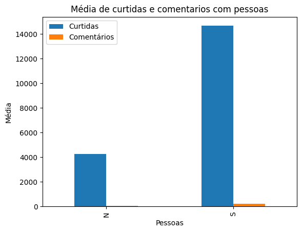
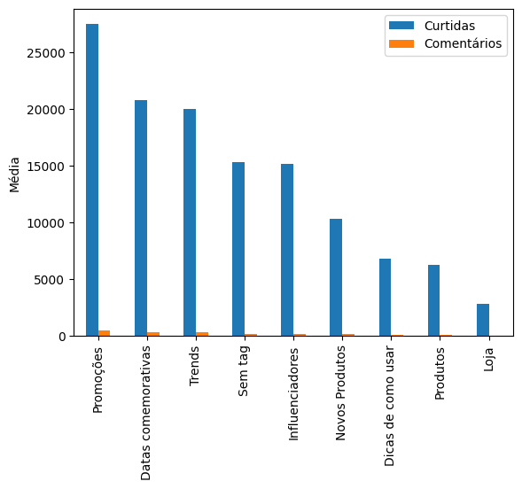

# 📲 Estudo de Engajamento no Instagram 

Este é um projeto simples de análise de dados desenvolvido para praticar Python e conceitos básicos sobre engajamento em redes sociais. A base de dados simula postagens no Instagram e foi fornecida durante um curso de Ciência de Dados. O objetivo foi identificar fatores que influenciam o engajamento das publicações.

> ⚠️ A base utilizada é fictícia e **não está associada a nenhuma empresa ou marca real**.

---

## 🎯 Objetivo

Realizar um estudo introdutório sobre engajamento no Instagram usando Python, explorando relações entre o tipo de postagem, as tags utilizadas e a presença de pessoas nas imagens.

Pontos principais da análise:

1. A inclusão de rostos nas imagens aumenta o engajamento?

2. Postagens com promoções ou campanhas geram mais interação?

3. Conteúdos em tendência (trends) ajudam a divulgar a marca?

---

## 🛠️ Tecnologias Utilizadas

- Python  
- Jupyter Notebook  
- Pandas  
- Matplotlib  
- Seaborn  

---

## 📊 Resultados e Visualizações

Foram analisadas mais de 300 postagens fictícias com diferentes formatos e tags.

### 👥 Postagens com Pessoas

Postagens com rostos visíveis apresentaram uma média maior de curtidas e comentários em comparação às postagens sem pessoas. Isso reforça a ideia de que mostrar pessoas nas imagens ajuda a aumentar o engajamento.

### 📸 Tipos de Postagens

Foi criada uma visualização em formato de gráfico de pizza para representar a distribuição dos formatos de conteúdo utilizados nas postagens: Foto, Vídeo, IGTV e Reels.

### 🚀 Tendências de Outros Nichos

A tag "Trends" aparece em terceiro lugar, com uma média de 20.024 curtidas e 352 comentários, o que indica que apostar em conteúdos em alta — mesmo fora do nicho principal — ajuda a ampliar o alcance e engajamento.

---

